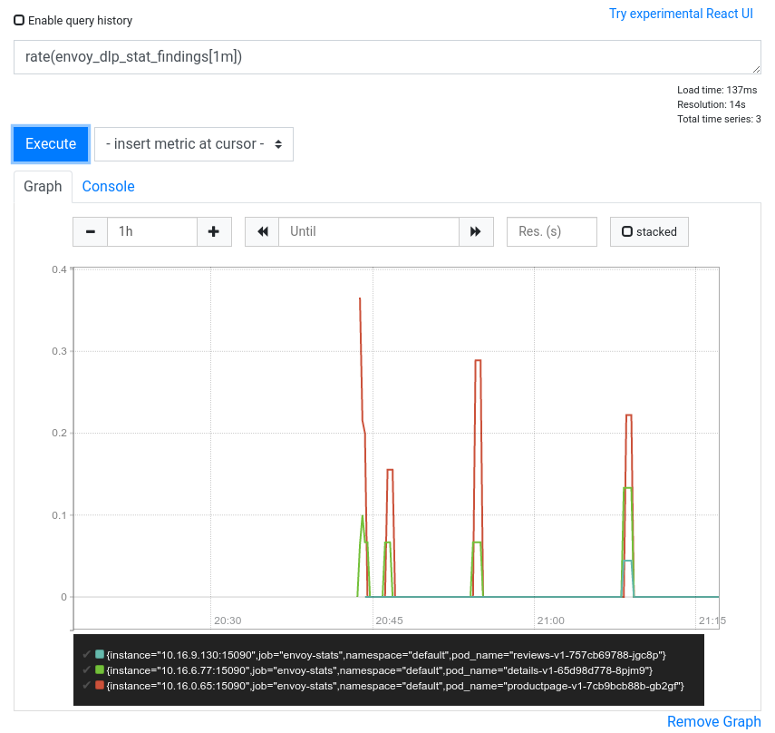

# Quickstart: Using Cloud DLP Filter for Envoy in Istio

This topic explains how to use DLP Filter for Envoy to inspect traffic in Istio.

## Before you begin

Before beginning this quickstart, be sure you have first [built the proxy
image](../README.md#build), and then installed and enabled the components described in this section.

### Istio

Install Istio and the sample Bookinfo application by following the [Getting
Started](https://istio.io/docs/setup/getting-started/) and [Bookinfo
Application](https://istio.io/docs/examples/bookinfo/) installation instructions on the Istio
website.

### Proxy image

Upload the [built the proxy image](../README.md#build) to the container registry of the Kubernetes
cluster where Istio is installed:

*   [Minikube](#minikube)
*   [Other](#other)

#### Minikube

Run this command to add the local proxy into Minikube container cache and make it available for
Istio to use.

```
minikube cache add bazel/container:dlp_proxy && \
minikube cache reload
```

#### Other

Run this command on the host where you built the proxy:

```
docker save bazel/container:dlp_proxy > dlp_proxy.tar
```

Upload the `dlp_proxy.tar` file to the host where Istio is running.

Next, install the proxy image in the image registry on the target host.

```
docker load < dlp_proxy.tar
```

### Cloud DLP

Enable Cloud DLP in Google Cloud: 

[Enable Cloud DLP](https://console.cloud.google.com/flows/enableapi?apiid=dlp.googleapis.com)

## Install DLP Filter in a sample Istio app

To install DLP Filter in your Istio service mesh, do the following:

*   [Obtain service account credentials for Cloud DLP](#obtain-service-account-credentials-for-cloud-dlp).
*   [Install proxy with DLP Filter in Istio](#install-proxy-with-dlp-filter-in-istio).
*   [Enable DLP Filter](#enable-dlp-filter).

Next you can:

*   [View the results](#view-the-results).
*   [Clean up](#clean-up).
*   [Troubleshoot](#troubleshooting).

### Obtain service account credentials for Cloud DLP

1.  Download Cloud DLP service account credentials to your machine. To learn how to set up and
    download service account credentials, see [Getting Started with
    Authentication](https://cloud.google.com/docs/authentication/getting-started). Give the service
    account credentials file the name `application_default_credentials.json`.
1.  Create a [Secret](https://kubernetes.io/docs/concepts/configuration/secret/) in your Kubernetes
    cluster and give it a name by using the following command. In this example, the provided name of
    the Secret is `google-dlp-adc`, and the path to the downloaded account credentials is
    `./application_default_credentials.json`.

```
kubectl create secret generic google-dlp-adc --from-file=./application_default_credentials.json
```

Run the following command to verify that the key has been created:

```
kubectl get secrets
```

This will print output similar to the following:

```
NAME                  TYPE                                  DATA   AGE
google-dlp-adc        Opaque                                1      1m
```

### Install proxy with DLP Filter in Istio

Update the Istio configuration to only download new containers if they are not available locally.
This step is needed to use the local custom proxy container with DLP Filter that was built earlier.

```
istioctl manifest apply --set profile=demo --set values.global.imagePullPolicy=IfNotPresent
```

Customize the BookInfo application to use the custom proxy by running the following command:

```
kubectl patch -f $ISTIO_DIR/samples/bookinfo/platform/kube/bookinfo.yaml -p '
spec:
  template:
    metadata:
      annotations:
        sidecar.istio.io/proxyImage: "bazel/container:dlp_proxy"
        sidecar.istio.io/userVolumeMount: '"'"'[{"name":"google-dlp-adc-volume", "mountPath":"/home/istio-proxy/.config/gcloud", "readonly":true}]'"'"'
        sidecar.istio.io/userVolume: '"'"'[{"name":"google-dlp-adc-volume", "secret":{"secretName":"google-dlp-adc"}}]'"'"'
        sidecar.istio.io/statsInclusionPrefixes: dlp_stat'
```

Run the following command, which will complete when the update is successful:

```
kubectl rollout status deployment.apps/productpage-v1
```

After the update finishes, Istio is using the custom proxy with DLP Filter. Next, we enable the
filter to start scanning traffic.

### Enable DLP Filter

Specify the name of your Cloud DLP project to be used by the filter to scan traffic replacing the
***PROJECT_NAME*** placeholder as indicated:

<pre>
export PROJECT_NAME=<strong><em>PROJECT_NAME</em></strong>
</pre>

The DLP Filter repository contains a sample filter configuration template for Istio. Go to the
`dlp-filter` repository's root folder and run the following command to enable traffic inspection in
all proxies:

```
cat istio/istio-envoyfilter.yaml | \
  sed "s;{project_id};${PROJECT_NAME};" | \
kubectl apply -f -
```

It may take a few minutes to update the configuration. You can check the status of your proxies by
running:

```
istioctl proxy-status
```

After about a minute, all proxies should have the status SYNCED. If not, see
[Troubleshooting](#troubleshooting).

### View the results

Now that DLP Filter for Envoy is deployed, it captures traffic going through the proxy and reports
each finding type into logs.

The log entry has the following format:

<pre>
[Envoy (Epoch 0)] [2020-03-12 21:08:16.320][25][warning][wasm] [external/envoy/source/extensions/common/wasm/context.cc:1080] wasm log: <strong><em>MESH_ID</em></strong>:<strong><em>NAMESPACE_ID</em></strong>:<strong><em>APP_NAME</em></strong>:<strong><em>POD_ID</em></strong>:DLP_DETECTED:<strong><em>INFOTYPE</em></strong>
</pre>

Following is a sample entry:

```
[Envoy (Epoch 0)] [2020-03-12 21:08:16.320][25][warning][wasm] [external/envoy/source/extensions/common/wasm/context.cc:1080] wasm log: cluster.local:default:reviews-v1:reviews-v1-757cb69788-jgc8p:DLP_DETECTED:PERSON_NAME
```

View the inspection results of a specific app by running the following command, replacing the 
***APP_NAME*** placeholder with your application name:

<pre>
kubectl logs $(kubectl get pod -l app=<strong><em>APP_NAME</em></strong> -o jsonpath={.items..metadata.name}) -c "istio-proxy" | grep DLP_
</pre>

### Clean up

To avoid incurring additional charges to your Google Cloud account for the resources used in this
quickstart, follow these steps.

1.  Remove the filter configuration from Istio by running the following command:

    ```
    kubectl delete -f [PATH-TO-dlp-envoy-filter.yaml]
    ```

1.  Delete the Istio Secret:

    ```
    kubectl delete secret google-dlp-adc
    ```

1.  Uninstall Istio and the sample Bookinfo application by following the [Getting Started -
    Uninstall](https://istio.io/docs/setup/getting-started/#uninstall) and [Bookinfo Application -
    Cleanup instructions](https://istio.io/docs/examples/bookinfo/#cleanup) on the Istio website.

### Troubleshooting

#### Viewing statistics

Viewing Istio statistics helps triage common problems with Envoy filter configuration.

Available statistics reported by the DLP Filter are:

*   `envoy_dlp_stat_inspected` The number of requests sent to Cloud DLP for inspection.
*   `envoy_dlp_stat_not_inspected` The number of messages not inspected due to sampling or grpc
errors.
*   `envoy_dlp_stat_total_bytes_inspected` The number of bytes sent to Cloud DLP for inspection.
*   `envoy_dlp_stat_total_bytes_not_inspected` The number of bytes not inspected due to sampling or
grpc errors.
*   `envoy_dlp_stat_grpc_error` The number of times grpc returned an error (grpc_status was
different than 0).
*   `envoy_dlp_stat_code_STATUS_CODE_grpc_status` The number of times a particular grpc
***`STATUS_CODE`*** has been returned.

It is expected that all service traffic is reported by first four statistics, indicating correct
filter operation. If any error statistics are reported, please [view the logs](#viewing-proxy-logs)
of the corresponding service.

To view statistics about DLP Filter:

1.  Send some traffic through your service mesh.
1.  Open the Prometheus dashboard by running the following command:

    ```
    istioctl dashboard prometheus query
    ```

1.  This opens a new browser page. Click the **Graph** tab, and then in the **Expression** field
    type the following:

    ```
    rate(envoy_dlp_stat_inspected[1m])
    ```

    This command shows how many requests per second have been inspected in a one-minute window.

    Following is a screenshot that illustrates the results of the command:

    

1.  Next, change the Expression field to display how many findings have been reported by using the following command:

    ```
    rate(envoy_dlp_stat_findings[1m])
    ```

    Following is a screenshot that illustrates the result of the command:

    

To learn more about querying Prometheus, see
[Querying basics](https://prometheus.io/docs/prometheus/latest/querying/basics/).

#### Viewing proxy logs

View the inspection results of a specific app by running the following command, replacing the 
***APP_NAME*** placeholder with your service name:

<pre>
kubectl logs $(kubectl get pod -l app=<strong><em>APP_NAME</em></strong> -o 
jsonpath={.items..metadata.name}) -c "istio-proxy"
</pre>

### Common issues

#### Proxies are in status STALE

##### Symptoms

The following command shows proxies in status STALE (Never Acknowledged):

```
istioctl proxy-status
```

##### Solution

Run the following command to see the logs of the proxy, replacing the ***APP_NAME*** placeholder
with the name of the app for which the proxy is in status STALE (Never Acknowledged):

<pre>
kubectl logs $(kubectl get pod -l app=<strong><em>APP_NAME</em></strong> -o jsonpath={.items..metadata.name}) -c "istio-proxy"
</pre>

Look for the following entry in the output:

```
Invalid path: /etc/istio/extensions/dlp-filter.wasm
```

If present, this entry indicates that DLP Filter configuration has been enabled, but that it has not
been found in the proxy container. Repeat the instructions in the [Install proxy with DLP Filter for
Envoy](#install-proxy-with-dlp-filter-in-istio) section for the failing proxy workload. Make sure
that the configuration has been updated and applied.